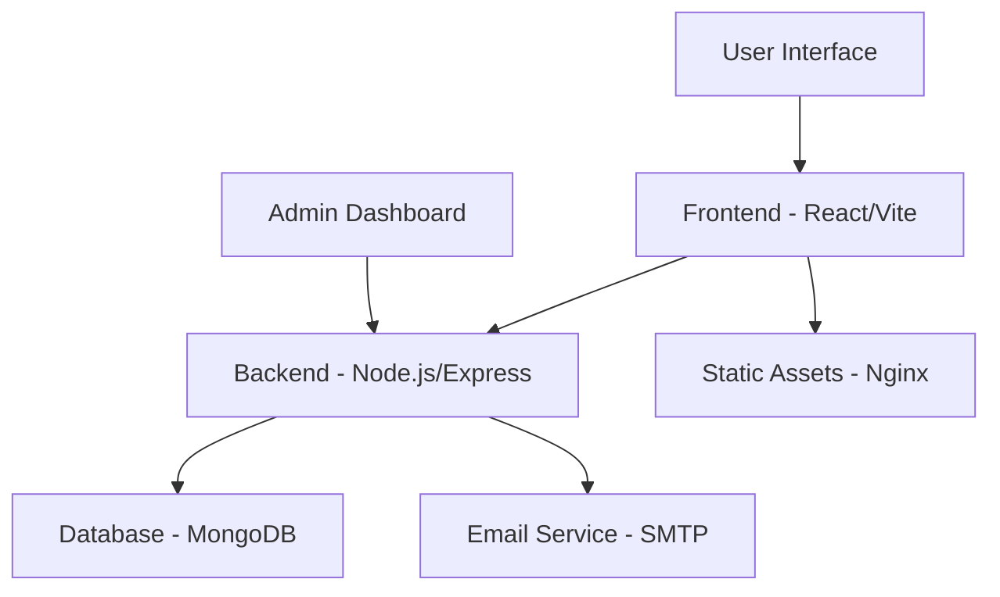

# 🏠 HopeNest - NGO Management Platform


A comprehensive web platform for NGO operations, featuring donation management, crowdfunding campaigns, volunteer coordination, and administrative tools.

## ✨ Features

### 🎯 Core Functionality
- **Donation Management**: Secure payment processing with real-time tracking
- **Crowdfunding Campaigns**: Create and manage fundraising campaigns
- **Volunteer Registration**: Streamlined volunteer onboarding and management
- **Admin Dashboard**: Comprehensive administrative control panel
- **User Authentication**: Secure login/registration with JWT tokens
- **Email Notifications**: Automated email confirmations and updates

### 🔒 Security Features
- JWT-based authentication
- Password hashing with bcrypt
- Input validation and sanitization
- Rate limiting for API endpoints
- CORS protection
- Security headers with Helmet.js
- File upload restrictions

### 📱 User Experience
- Responsive design for all devices
- Modern React UI with smooth animations
- Real-time form validation
- Intuitive navigation and user flows
- Accessibility compliance

## 🚀 Quick Start

### Prerequisites
- Node.js 18+ 
- MongoDB 7.0+
- Docker & Docker Compose (recommended)

### Development Setup
```bash
# Clone the repository
git clone <repository-url>
cd NgoCode

# Setup development environment
chmod +x setup-dev.sh
./setup-dev.sh setup

# Start development servers
./setup-dev.sh start
```

### Production Deployment (Docker)
```bash
# Configure environment
cp .env.docker .env
# Edit .env with your production values

# Deploy with Docker
chmod +x deploy.sh
./deploy.sh deploy
```

Access the application:
- **Frontend**: http://localhost
- **Backend API**: http://localhost:5000
- **Health Check**: http://localhost:5000/health

## 🏗️ Architecture



### Technology Stack

#### Frontend
- **React 19** - UI library with hooks and context
- **Vite** - Fast build tool and dev server
- **Tailwind CSS** - Utility-first CSS framework
- **Framer Motion** - Animation library
- **React Router** - Client-side routing
- **Axios** - HTTP client

#### Backend
- **Node.js 18+** - JavaScript runtime
- **Express 5** - Web application framework
- **MongoDB** - NoSQL database
- **Mongoose** - MongoDB object modeling
- **JWT** - JSON Web Tokens for authentication
- **bcryptjs** - Password hashing
- **Nodemailer** - Email sending
- **Multer** - File upload handling

#### Security & DevOps
- **Helmet** - Security headers
- **Express Rate Limit** - API rate limiting
- **CORS** - Cross-origin resource sharing
- **Winston** - Logging framework
- **Docker** - Containerization
- **GitHub Actions** - CI/CD pipeline

## 📁 Project Structure

```
NgoCode/
├── backend/                    # Node.js backend
│   ├── config/                # Configuration files
│   │   └── logger.js          # Winston logging configuration
│   ├── middleware/            # Express middleware
│   │   ├── auth.js           # Authentication middleware
│   │   └── security.js       # Security middleware
│   ├── models/               # Mongoose models
│   │   ├── User.js          # User model
│   │   ├── Campaign.js      # Campaign model
│   │   ├── Donation.js      # Donation model
│   │   └── Volunteer.js     # Volunteer model
│   ├── routes/              # API routes
│   │   ├── auth.js         # Authentication routes
│   │   ├── api.js          # General API routes
│   │   ├── donations.js    # Donation management
│   │   ├── volunteers.js   # Volunteer management
│   │   └── crowdfunding.js # Crowdfunding campaigns
│   ├── utils/              # Utility functions
│   │   └── mailer.js      # Email functionality
│   ├── uploads/           # File upload storage
│   ├── logs/             # Application logs
│   ├── .env              # Environment variables
│   ├── package.json      # Backend dependencies
│   └── server.js         # Main server file
├── HopeNest/                # React frontend
│   ├── src/
│   │   ├── component/      # React components
│   │   │   ├── AdminDashboard.jsx
│   │   │   ├── Campaigns.jsx
│   │   │   ├── Crowdfunding.jsx
│   │   │   ├── CrowdfundingAdminPanel.jsx
│   │   │   ├── CrowdfundingApply.jsx
│   │   │   ├── Donation.jsx
│   │   │   ├── Footer.jsx
│   │   │   ├── Gallary.jsx
│   │   │   ├── HeroPart.jsx
│   │   │   ├── Navbar.jsx
│   │   │   ├── PrivateRoute.jsx
│   │   │   ├── SponsorsSection.jsx
│   │   │   ├── Team.jsx
│   │   │   ├── Video.jsx
│   │   │   └── WhDoGo.jsx
│   │   ├── context/       # React context
│   │   │   └── AuthContext.jsx
│   │   ├── pages/         # Page components
│   │   │   ├── About.jsx
│   │   │   ├── Account.jsx
│   │   │   ├── Camp.jsx
│   │   │   ├── Crowd.jsx
│   │   │   ├── CrowdApply.jsx
│   │   │   ├── Donate.jsx
│   │   │   ├── Home.jsx
│   │   │   └── Login.jsx
│   │   ├── services/      # API services
│   │   │   └── api.js
│   │   ├── css/          # Stylesheets
│   │   └── App.jsx       # Main App component
│   ├── .env              # Frontend environment variables
│   ├── package.json      # Frontend dependencies
│   ├── vite.config.js    # Vite configuration
│   └── nginx.conf        # Nginx configuration
├── .github/              # GitHub workflows
│   └── workflows/
│       └── ci-cd.yml    # CI/CD pipeline
├── docker-compose.yml    # Docker composition
├── deploy.sh            # Deployment script (Linux/macOS)
├── deploy.bat          # Deployment script (Windows)
├── setup-dev.sh       # Development setup script
├── DEPLOYMENT.md      # Deployment documentation
└── README.md         # This file
```

## 🔧 Configuration

### Environment Variables

#### Backend Configuration
```bash
# Database
MONGODB_URI=mongodb://localhost:27017/hopenest
JWT_SECRET=your-secure-jwt-secret

# Email Settings
SMTP_HOST=smtp.gmail.com
SMTP_PORT=587
SMTP_USER=your-email@gmail.com
SMTP_PASS=your-app-password

# Security
ENABLE_HELMET=true
ENABLE_RATE_LIMITING=true
ALLOWED_ORIGINS=http://localhost:5173

# Logging
LOG_LEVEL=info
```

#### Frontend Configuration
```bash
VITE_API_URL=http://localhost:5000/api
VITE_API_HOST=http://localhost:5000
VITE_APP_NAME=HopeNest
```

## 🛠️ Development

### Running in Development Mode

1. **Start Backend**:
```bash
cd backend
npm install
npm run dev
```

2. **Start Frontend**:
```bash
cd HopeNest
npm install
npm run dev
```

3. **Access Application**:
   - Frontend: http://localhost:5173
   - Backend: http://localhost:5000

### API Documentation

#### Authentication Endpoints
- `POST /api/auth/signup` - User registration
- `POST /api/auth/login` - User login
- `GET /api/auth/me` - Get current user
- `PUT /api/auth/update` - Update user profile

#### Campaign Endpoints
- `GET /api/campaigns` - List all campaigns
- `GET /api/campaigns/:id` - Get campaign details
- `POST /api/campaigns` - Create campaign (admin)
- `PUT /api/campaigns/:id` - Update campaign (admin)

#### Donation Endpoints
- `POST /api/donations` - Create donation
- `GET /api/donations/my` - Get user donations
- `GET /api/donations` - List all donations (admin)

#### Volunteer Endpoints
- `POST /api/volunteers` - Register as volunteer
- `GET /api/volunteers/my` - Get user volunteer registrations
- `GET /api/volunteers` - List all volunteers (admin)

#### Crowdfunding Endpoints
- `GET /api/crowdfunding` - List approved campaigns
- `POST /api/crowdfunding/apply` - Apply for crowdfunding
- `GET /api/crowdfunding/my` - Get user applications
- `PUT /api/crowdfunding/:id/approve` - Approve application (admin)

### Testing

```bash
# Run backend tests
cd backend
npm test

# Run frontend tests
cd HopeNest
npm test

# Run linting
npm run lint
```

## 🚀 Production Deployment

### Docker Deployment (Recommended)

1. **Prepare Environment**:
```bash
cp .env.docker .env
# Edit .env with production values
```

2. **Deploy**:
```bash
./deploy.sh deploy
```

3. **Monitor**:
```bash
# Check service status
docker-compose ps

# View logs
docker-compose logs -f

# Health check
curl http://localhost:5000/health
```

### Manual Deployment

See [DEPLOYMENT.md](DEPLOYMENT.md) for detailed instructions.

## 📊 Monitoring & Maintenance

### Health Checks
- **Application Health**: `GET /health`
- **API Status**: `GET /api/status`
- **Database Connection**: Included in health endpoint

### Logging
- **Development**: Console output
- **Production**: File-based logging with Winston
- **Log Levels**: error, warn, info, debug

### Backup Strategy
- **Database**: Daily automated backups
- **File Uploads**: Regular backup to cloud storage
- **Configuration**: Version controlled

## 🔐 Security

### Authentication & Authorization
- JWT tokens with secure expiration
- Role-based access control (user/admin)
- Password hashing with bcrypt
- Secure session management

### API Security
- Rate limiting per endpoint
- Input validation and sanitization
- CORS protection
- Security headers (Helmet.js)
- File upload restrictions

### Data Protection
- MongoDB query injection prevention
- XSS protection
- Parameter pollution prevention
- Secure file upload handling

## 🤝 Contributing

1. **Fork the repository**
2. **Create feature branch**: `git checkout -b feature/amazing-feature`
3. **Make changes and test**
4. **Commit changes**: `git commit -m 'Add amazing feature'`
5. **Push to branch**: `git push origin feature/amazing-feature`
6. **Create Pull Request**

### Development Guidelines
- Follow existing code style
- Write meaningful commit messages
- Add tests for new features
- Update documentation as needed
- Ensure security best practices

## 📄 License

This project is licensed under the MIT License - see the [LICENSE](LICENSE) file for details.

## 🆘 Support

### Getting Help
1. **Documentation**: Check DEPLOYMENT.md for deployment issues
2. **Issues**: Create GitHub issue for bugs/features
3. **Security**: Report security issues privately

### Common Issues
- **CORS Errors**: Check ALLOWED_ORIGINS configuration
- **Database Connection**: Verify MongoDB URI and credentials
- **Email Issues**: Confirm SMTP settings and app passwords
- **File Upload Errors**: Check upload directory permissions

## 📈 Roadmap

### Upcoming Features
- [ ] Payment gateway integration (Stripe/PayPal)
- [ ] Multi-language support
- [ ] Mobile application
- [ ] Advanced analytics dashboard
- [ ] Social media integration
- [ ] Automated reporting system

### Performance Improvements
- [ ] Database query optimization
- [ ] CDN integration for static assets
- [ ] API response caching
- [ ] Image optimization pipeline

## 🙏 Acknowledgments

- **React Team** - For the amazing React framework
- **Express.js** - For the robust web framework
- **MongoDB** - For the flexible database solution
- **Open Source Community** - For the fantastic tools and libraries

---

**Made with ❤️ for NGOs making a difference in the world**

For detailed deployment instructions, see [DEPLOYMENT.md](DEPLOYMENT.md)